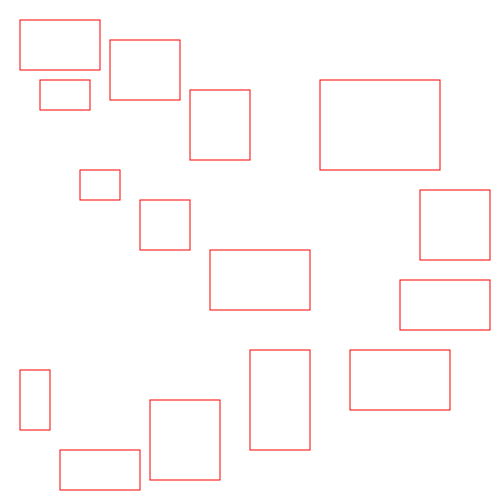

# AI generated SVG-Grids

## 1. Iteration

**Prompt:**
Generate an asymmetric grid as an SVG. Use red lines on a white ground. Use at least 10 rectangles for the grid but feel free to use more.

Make three variations.

**Model:** ChatGPT / GPT-3.5

Results:

## 2. Iteration

**Prompt:**

Generate an asymmetric grid as an SVG. Use red lines on a white ground. Use at least 10 rectangles for the grid but feel free to use more.

Make three variations.

**Model:** ChatGPT / GPT-4

Results:

## 3. Iteration

**Prompt:**

Generate an asymmetric grid as an SVG. Use red lines on a white ground. Use at least 10 rectangles for the grid but feel free to use more.

Make three variations.

**Model:** HuggingChat with the model OpenAssistant/oasst-sft-6-llama-30b

Results:

